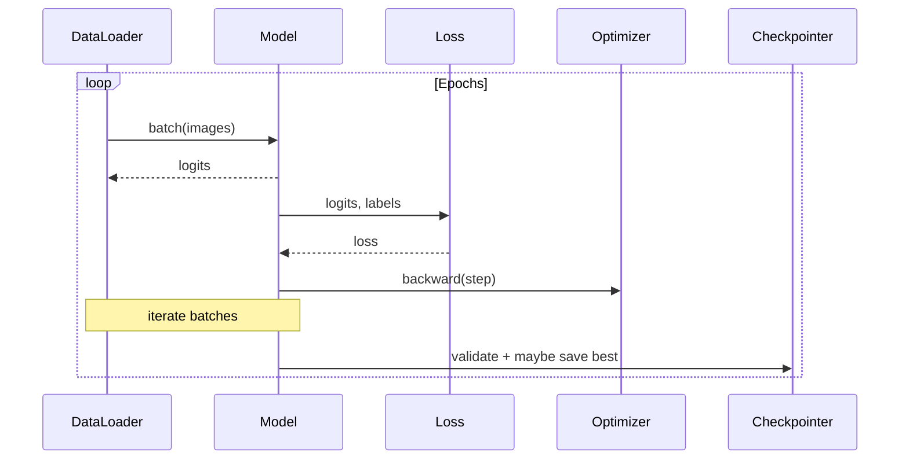

# 3D Medical Image Segmentation Documentation

Author: Thabhelo Duve  
Supervisor: William (Liam) Oswald  
Organization: Analytical AI  
Duration: 12 weeks (Fall 2025)

This document serves as the authoritative record of the project: design decisions, software choices and justification, experimental procedures, and results.

## 1. Introduction and Objectives
- Comparative analysis of 3D U-Net, UNETR, SegResNet across BraTS, MSD Liver, TotalSegmentator.
- Goals: performance benchmarking, best-practices, and recommendations for 3D medical segmentation.

### Problem Background
Voxel-wise semantic segmentation assigns a class label to every voxel in a 3D medical volume (CT/MRI). Challenges include anisotropic spacing, large memory footprint, class imbalance, and domain variability across scanners and hospitals.

### Approach Summary
- Preprocess and normalize 3D volumes with MONAI transforms.
- Train three architectures representing convolutional, transformer-augmented, and residual families.
- Evaluate with Dice/IoU and report training efficiency (epochs/time).

## 2. Software and Platform Choices
- Compute: Google Colab (A100 GPU), storage via Google Drive.
- Frameworks: PyTorch + MONAI. Justification: mature 3D tooling, extensive transforms/metrics, active community.
- Experiment tracking: Git commits + on-disk results; future: lightweight CSV/JSON aggregation.

### Libraries In Use
- PyTorch (core DL), MONAI (medical imaging transforms, metrics, networks)
- NumPy/SciPy/Pandas (data ops), Matplotlib/Seaborn (plots)
- nibabel/SimpleITK (NIfTI IO)

### Dataset Handling
- Canonical dataset keys: `brats`, `msd_liver`, `totalsegmentator`
- Accepted aliases: `brats`/`brats2021` → `brats`; `msd`/`task03_liver` → `msd_liver`; `TotalSegmentator` only for the third dataset.
- Current folder names (local Drive): `BraTS/`, `MSD/`, `TotalSegmentator/`.

## 3. Data Management
- Datasets located at: `/content/drive/MyDrive/datasets`.
- Expected subfolders: `BraTS/`, `MSD_Liver/`, `TotalSegmentator/`.
- File formats: NIfTI (`.nii`, `.nii.gz`).

### Data Pipeline (Preprocessing & Augmentation)
```mermaid
flowchart LR
    A[Load (NIfTI)] --> B[EnsureChannelFirst]
    B --> C[Spacing (1,1,1) mm]
    C --> D[Orientation RAS]
    D --> E{Dataset}
    E -- BraTS --> F[Normalize Intensity (nonzero, channel-wise)]
    E -- MSD Liver --> G[Scale HU to 0..1 (-175..250)]
    E -- TotalSegmentator --> H[Scale HU to 0..1 (-1024..1024)]
    F & G & H --> I[CropForeground]
    I --> J{Phase}
    J -- Train --> K[RandCropByPosNegLabel + RandFlip/Rotate + Intensity Jitter]
    J -- Val/Test --> L[Identity]
    K & L --> M[To Tensor]
```

## 4. Methodology
- 3×3 experiment matrix (architectures × datasets).
- Config-driven training (see `configs/`).
- Preprocessing and augmentation using MONAI.
- Evaluation metrics: Dice, IoU, Hausdorff, surface distance, sensitivity, specificity.

### Architectures
- 3D U-Net (encoder-decoder with skip connections) — strong baseline for volumetric tasks.
- UNETR (ViT encoder + CNN decoder) — leverages global context via self-attention.
- SegResNet (residual encoder-decoder) — efficient training with residual blocks.

### Training Loop


## 5. Reproducibility
- All scripts and configs under version control.
- Random seeds documented per run; checkpoints stored under Drive `results/`.

## 6. Progress Timeline (Engineering Log)
- 2025-08-29: Repo initialized; structure scaffolded; requirements and setup added.
- 2025-08-29: Base config added for Colab paths; script stubs created.
- 2025-08-29: Dataset loaders implemented for BraTS, MSD Liver, TotalSegmentator.
- 2025-08-29: Preprocessing/augmentation transforms and dataloader builders implemented.
- 2025-08-29: Colab bootstrap fixed to clone repo to Drive and install requirements.
- 2025-08-29: EDA notebook stabilized; dataset folder synonyms tested on Drive.
- 2025-08-29: Standardized on folder name `TotalSegmentator`; removed deprecated synonyms.
- 2025-08-29: Simplified environment path logic in notebook; removed unused helpers.

## 7. Results (to be populated)
- Record per-experiment metrics, resource usage, and training curves.
- Comparative tables and plots.

### Primary Metrics
- Dice Coefficient: \( Dice = \frac{2TP}{2TP + FP + FN} \)
- Mean IoU: \( IoU = \frac{TP}{TP + FP + FN} \)

## 8. Discussion (to be populated)
- Interpretation of results, dataset/architecture interactions, limitations.

## 9. Conclusion (to be populated)
- Key findings and recommendations.

## 10. References
- Include citations for datasets and key methods.

### Citations
- Çiçek, Ö. et al. "3D U-Net: Learning Dense Volumetric Segmentation from Sparse Annotation." MICCAI 2016.
- Hatamizadeh, A. et al. "UNETR: Transformers for 3D Medical Image Segmentation." WACV 2022.
- He, K. et al. "Deep Residual Learning for Image Recognition." CVPR 2016. (SegResNet builds on residual design; MONAI implementation.)
- MONAI Consortium. "MONAI: Open-Source Framework for Healthcare AI." arXiv:2211.02701.
- Menze, B.H. et al. "The Multimodal Brain Tumor Image Segmentation Benchmark (BRATS)." IEEE TMI 2015.
- Simpson, A.L. et al. "Medical Segmentation Decathlon." arXiv:1902.09063.
- Wasserthal, J. et al. "TotalSegmentator: Robust Segmentation of 104 Anatomic Structures in CT." Radiology: AI 2023.

---

