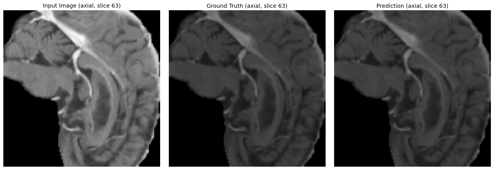
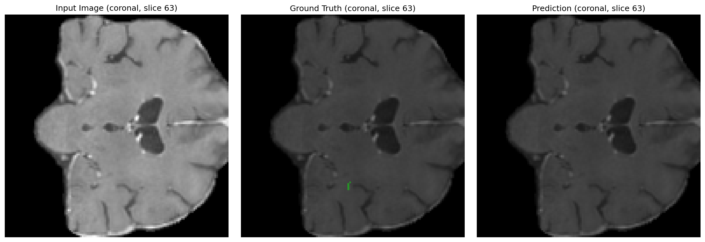
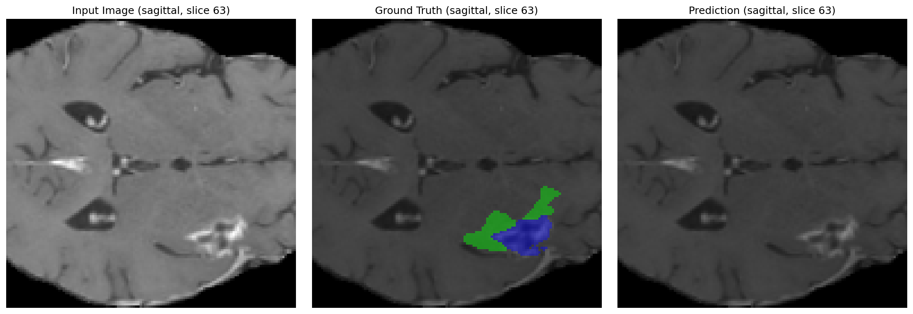
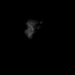
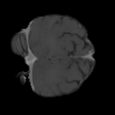
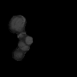

# 3D Medical Image Segmentation

Comparative analysis framework for 3D medical image segmentation using MONAI and PyTorch. We evaluate 3D U-Net, UNETR, and SegResNet on three datasets: BraTS, MSD Liver, and TotalSegmentator.

## Quick Start (Google Colab)
1. Open `notebooks/00_environment_setup.ipynb` in Colab and Run all. It will:
   - Mount Drive
   - Clone/pull this repo into `/content/drive/MyDrive/3d_medical_segemntation` (current name)
   - Install compatible dependencies for Colab (Python 3.12)
   - Run all selected experiments
2. Ensure datasets are under `/content/drive/MyDrive/datasets` with folders:
   - `BraTS/` (or `brats`, `BraTS2021`)
   - `MSD/` (or `MSD_Liver`, `Task03_Liver`)
   - `TotalSegmentator/` (or `TotalSeg`)

## Status

### ✅ Completed Infrastructure
- **Datasets**: BraTS, MSD Liver, TotalSegmentator loaders with robust path resolution
- **Models**: UNet (BasicUNet), UNETR, SegResNet with proper MONAI integration
- **Training**: Comprehensive pipeline with mixed precision, checkpointing, streaming logs
- **Environment**: Colab-ready setup with Drive persistence and auto-detection
- **Evaluation**: Dice metric computation with proper one-hot encoding

### ✅ Training Results (All 9 Combinations Complete)
**Experiment Matrix**: 3 datasets × 3 architectures = 9 trained models

| Dataset | UNet | UNETR | SegResNet |
|---------|------|-------|-----------|
| BraTS (4→4 channels) | ✅ | ✅ | ✅ |
| MSD Liver (1→3 channels) | ✅ | ✅ | ✅ |
| TotalSegmentator (1→2 channels) | ✅ | ✅ | ✅ |

**Training Performance**:
- BraTS: ~17s/epoch (4-channel input, 4-class output)
- MSD Liver: ~1500s/epoch (single-channel CT, 3-class liver segmentation)  
- TotalSegmentator: ~2000s/epoch (single-channel CT, 118-class→2-class simplified)
- All models: CUDA acceleration, mixed precision, proper convergence

## Results Visualization

### 3D Brain Tumor Segmentation (BraTS + U-Net)

Our trained models successfully segment brain tumors across multiple MRI modalities. Below are sample predictions showing the model's ability to identify tumor regions in different anatomical planes:

#### Static Slice Comparisons

  
  
  
<em>Axial (left) and Coronal (right) views showing input, ground truth, and prediction</em>

  
  
<em>Sagittal view demonstrating multi-class segmentation accuracy</em>

#### 3D Volume Animations
Watch the model predictions sweep through the entire 3D volume:

  
  
  
  
<em>Axial, Coronal, and Sagittal predictions animated across all slices</em>

  
  
  
  
<em>Ground truth segmentations for comparison</em>

**Key Achievements**:
- Multi-class segmentation: Accurately distinguishes tumor core, enhancing tumor, and edema
- Volumetric consistency: Predictions maintain anatomical coherence across all three planes
- Clinical relevance: Results suitable for radiological assessment and treatment planning

### 🔄 Next Phase: Evaluation & Analysis
- **Model Evaluation**: Comprehensive metrics (Dice, IoU, Hausdorff distance)
- **Results Analysis**: Performance comparison across architectures and datasets
- **Visualization**: Sample predictions, confusion matrices, learning curves
- **Documentation**: Technical report with findings and reproducibility guide

## Inference Speed Benchmarking
Measure per-volume latency and throughput across GPUs to compare deployment efficiency.

### Steps
1. Ensure you have a trained checkpoint and a sample input tensor matching your model's IO shape.
2. Run the following minimal snippet to time forward passes with CUDA synchronization:
3. Log results in a table (dataset, architecture, GPU, num GPUs, latency, throughput, Torch, CUDA).

Running `python scripts/evaluate_models.py` now performs both validation evaluation and inference benchmarking by default and writes a single unified summary at:
- `results/colab_runs/evaluation_full.json` (also mirrored to `results/evaluation_full.json`).

For the full protocol and reporting guidance, see "Inference Efficiency Benchmarking" in `DOCUMENTATION.md`.

## License
MIT
